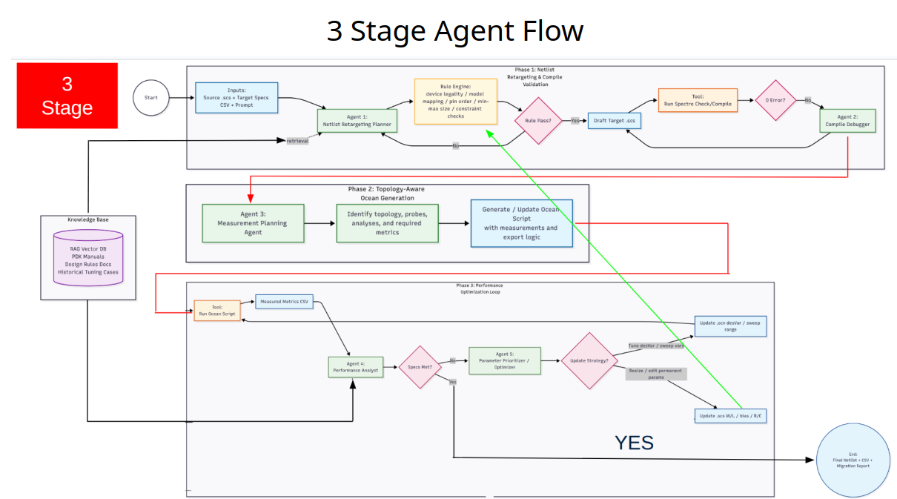

# AURA — Agentic Analog IC Migration

**Microsoft × UC Irvine M.Eng Capstone · Dean's Favorite (2026)**

AURA is a LangGraph-based orchestration prototype for migrating analog IC
netlists between process design kits (PDKs). It turns a source Spectre netlist,
target specifications, and a migration prompt into a retargeted netlist,
generated Ocean measurements, validation artifacts, and an optimization report.

> **Recognition:** selected as a **Dean's Favorite (Honored)** project in the
> UC Irvine M.Eng Capstone program. I developed the agent orchestration and EDA
> workflow as part of an industry-sponsored capstone with Microsoft.

[Presentation deck](AURA_Agentic_Framework_Yunbo.pptx) ·
[PDF preview](ppt_preview/AURA_Agentic_Framework_Yunbo.pdf) ·
[UI prototype](front_end.html)

## The problem

Moving an analog design to another technology node is not a simple text
translation. Model names, legal device dimensions, bias points, simulator
configuration, measurement scripts, and performance tradeoffs all change
together. A useful migration system therefore needs both deterministic
engineering checks and an iterative decision loop.

AURA explores how an explicit agent graph can organize that work while keeping
every decision and generated artifact inspectable.

## System overview



| Stage | Agent workflow | Output |
| --- | --- | --- |
| 1. Retarget and validate | Load inputs → retrieve local examples → build a migration plan → rewrite devices and parameters → apply rule gates → compile/debug | Retarget plan, draft Spectre netlist, rule report, compile log |
| 2. Plan measurements | Infer circuit nodes/topology → choose DC, AC, and transient analyses → generate Ocean/Skill | Measurement plan and reproducible `.ocn` script |
| 3. Analyze and optimize | Compare measured metrics with the target CSV → prioritize failed specs → tune parameters → route back through validation | Metrics CSV, optimization trace, final netlist, migration report |

The graph uses a shared typed state and conditional routing rather than a
single opaque prompt. Failed rules return to retargeting, Spectre errors enter a
bounded debugger loop, and missed performance targets trigger another
optimization iteration.

## What I built

- A 12-node LangGraph workflow with explicit success, retry, and termination
  paths.
- Spectre netlist parsing and transformation for includes, MOS model mapping,
  minimum geometry, and design parameters.
- A deterministic rule engine that checks model compatibility, MOS pin order,
  minimum width/length, and required supply parameters.
- Topology-aware measurement planning and Ocean/Skill script generation.
- Wrappers for Cadence Spectre and Ocean with bounded timeouts and log parsing.
- A spec-driven optimization loop for gain, bandwidth, power, and output
  common-mode tradeoffs.
- Artifact-first execution: each run records plans, intermediate netlists,
  logs, metrics, generated scripts, and a final Markdown report.
- A dry-run mode that exercises the complete graph without licensed EDA tools.

## Quick start

Python 3.10 or newer is recommended.

```bash
git clone https://github.com/quantumdotsss/Microsoft-AURA-Agentic-Analog-IC-Migration.git
cd Microsoft-AURA-Agentic-Analog-IC-Migration

python -m venv .venv
source .venv/bin/activate
pip install -r requirements.txt
cp .env.example .env
```

Run the included synthetic example:

```bash
python run_agent.py \
  --source examples/source_amplifier_example.scs \
  --target-specs examples/target_specs_example.csv \
  --target-pdk ptm22_lp \
  --max-iterations 4 \
  --prompt "Retarget the example 45 nm amplifier to PTM 22 nm LP while preserving topology."
```

Dry-run mode is enabled by default. It performs the transformations, rule
checks, routing, Ocean generation, and report creation, but substitutes
synthetic metrics for Spectre/Ocean results.

Each run writes:

```text
workspace/runs/<run_id>/
├── retarget_plan_attempt_*.json
├── draft_target_attempt_*.scs
├── rule_check.json
├── measurement_plan.json
├── measurements.ocn
├── measured_metrics.csv
└── final_state.json

outputs/<run_id>/
├── final_target.scs
├── measurements.ocn
├── measured_metrics.csv
└── migration_report.md
```

## Running with Cadence

Real simulation requires a licensed Cadence environment and model files that
you are authorized to use. Those proprietary dependencies are intentionally
not included.

Set the relevant values in `.env` or export them before running:

```bash
export AURA_DRY_RUN=false
export AURA_CADENCE_SETUP="source /path/to/your/cadence/profile"
export SPECTRE_BIN=spectre
export OCEAN_BIN=ocean
export AURA_PTM22_MODEL_PATH="/licensed/path/to/22nm_LP.pm"
```

Run AURA directly on the configured Linux/Cadence host. The agent does not
perform SSH or transmit netlists to an external service.

## Repository map

| Path | Purpose |
| --- | --- |
| [`run_agent.py`](run_agent.py) | Reproducible CLI entry point |
| [`codex_agent/graph.py`](codex_agent/graph.py) | LangGraph topology and conditional routers |
| [`codex_agent/nodes.py`](codex_agent/nodes.py) | Workflow nodes for retargeting, validation, measurement, and optimization |
| [`codex_agent/tools.py`](codex_agent/tools.py) | Netlist parser, rule engine, EDA wrappers, metric comparison, and tuning logic |
| [`codex_agent/state.py`](codex_agent/state.py) | Shared typed state contract |
| [`examples/`](examples/) | Public synthetic netlist and target-spec examples |
| [`tests/`](tests/) | Unit tests for core parsing and retargeting behavior |
| [`front_end.html`](front_end.html) | Exploratory five-run UI shell; its API backend is not included in this repository |
| [`scripts/generate_agent_ppt.py`](scripts/generate_agent_ppt.py) | Rebuilds the project presentation |

## Scope and limitations

This repository is a functional research prototype, not a signoff-ready analog
migration product.

- The current retargeting planner and optimizer are deterministic heuristics;
  replacing them with an LLM plus structured retrieval was planned future work.
- Dry-run metrics are synthetic workflow fixtures, not circuit-performance
  claims.
- Real PDK migration results require licensed models and Cadence validation.
- The local retrieval utility searches user-supplied engineering folders; this
  public repository contains no proprietary PDK documentation or sponsor data.
- The HTML interface is a UI prototype and is not wired to the Python CLI.

These boundaries are intentional: they keep the public project reproducible
while separating the orchestration research from licensed EDA assets.

## Capstone context

Developed by **Yunbo Wang** for the **UC Irvine Samueli School of Engineering
M.Eng Capstone**, in collaboration with Microsoft industry liaisons. The project
was recognized as a **Dean's Favorite (Honored)**.

The included presentation documents the implemented agent framework, design
decisions, current capabilities, and next steps.
